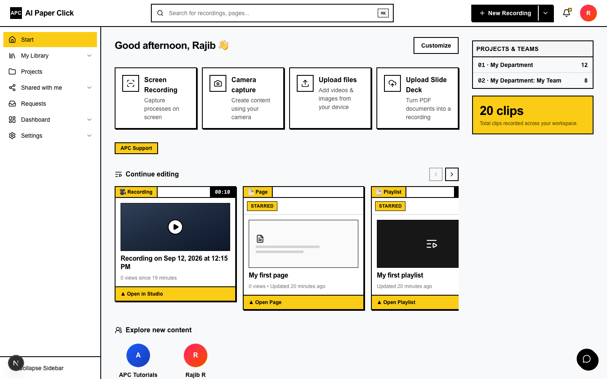
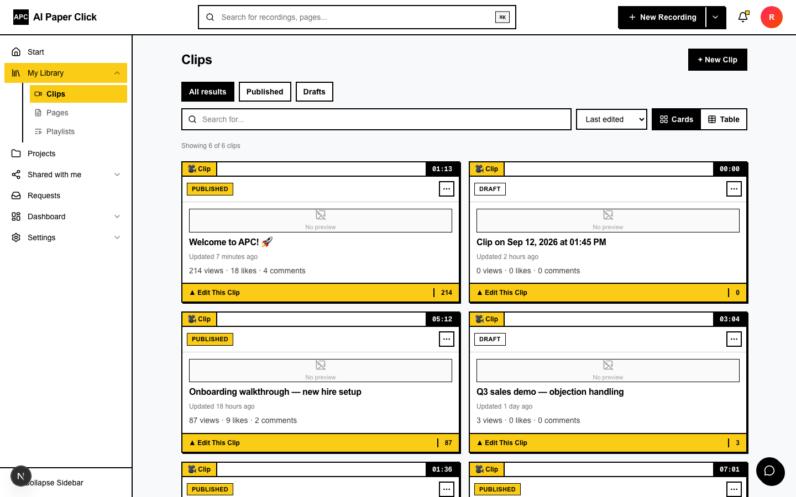
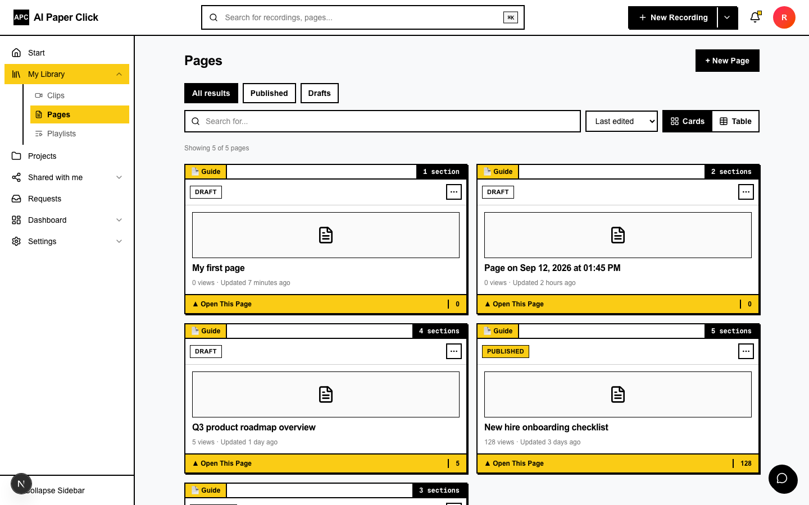
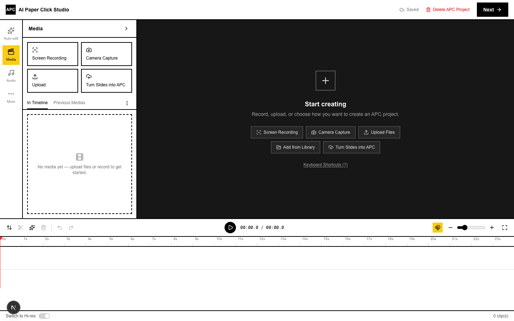
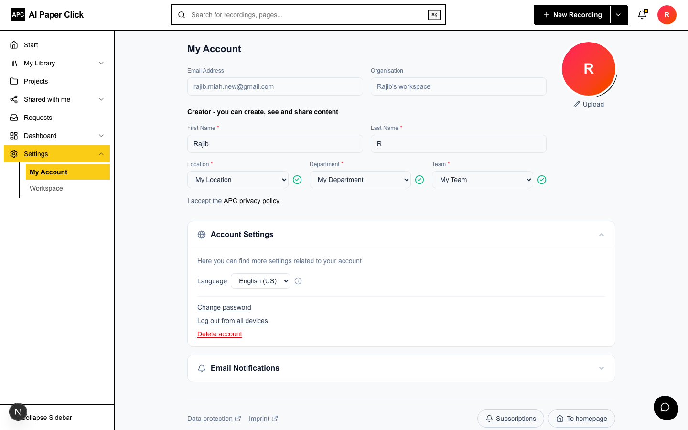
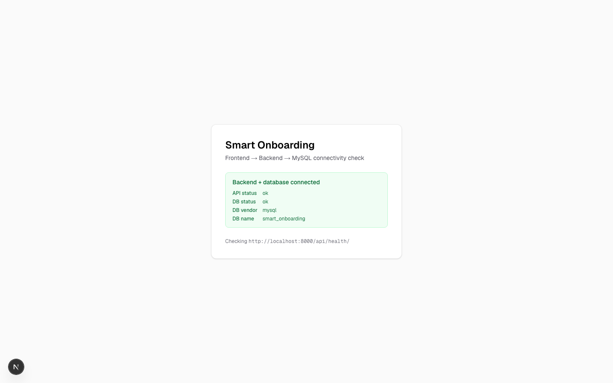
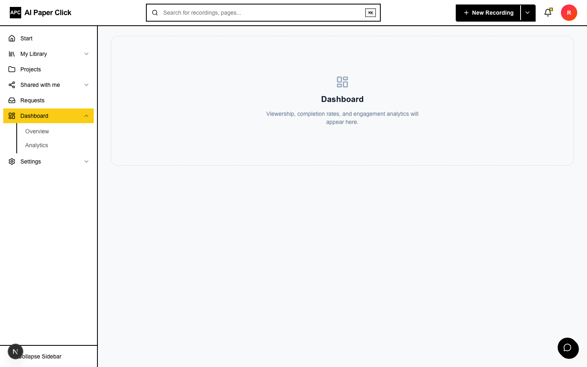
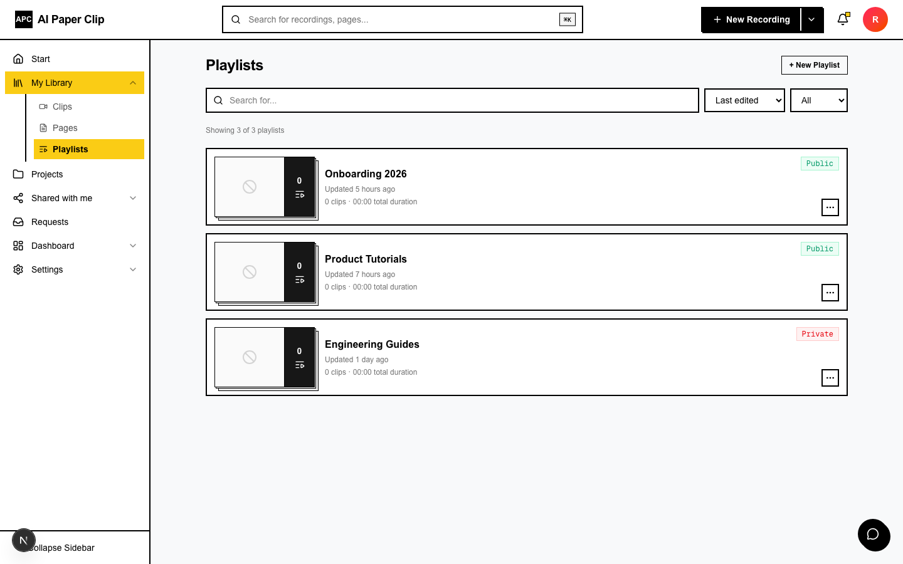
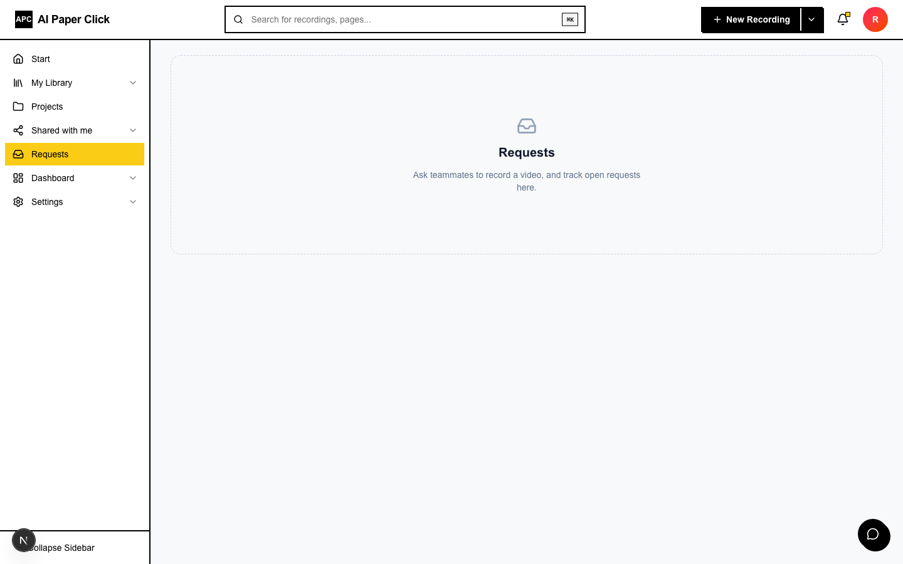
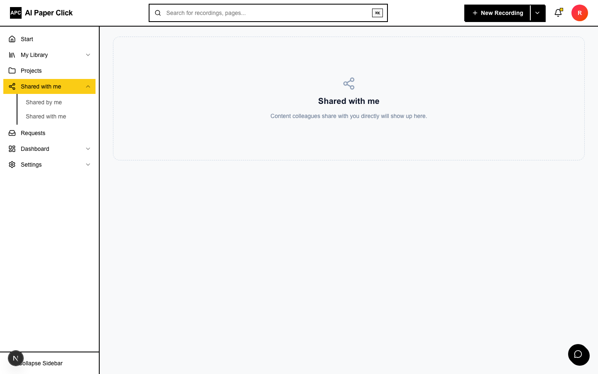

# Smart Onboarding — AI Paper Clip (APC)

AI-powered onboarding video tutorial & documentation platform.

## Documentation

| Doc | Covers |
|---|---|
| [Architecture](docs/architecture.md) | Stack, project layout tree |
| [Pages](docs/pages.md) | Route → screenshot map |
| [Setup](docs/setup.md) | Prerequisites, first-time setup, verify, everyday commands |
| [Configuration](docs/configuration.md) | `.env` files for Docker Compose, backend & frontend |
| [Branching workflow](docs/branching.md) | `main` / `dev` / `test` / `feat/*` convention |

## Screenshots

One screenshot per page — see [docs/pages.md](docs/pages.md) for how each
maps to a route in the code.

### Dashboard

### Library — Clips

### Library — Pages

### Video Studio

### Account Settings

### Health Check

Placeholder pages (empty state only, no feature built yet)

### Analytics

### Library — Playlists

### Projects

### Requests

### Shared with me

